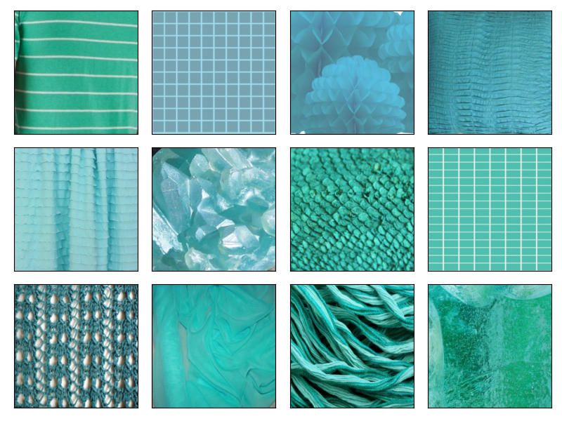
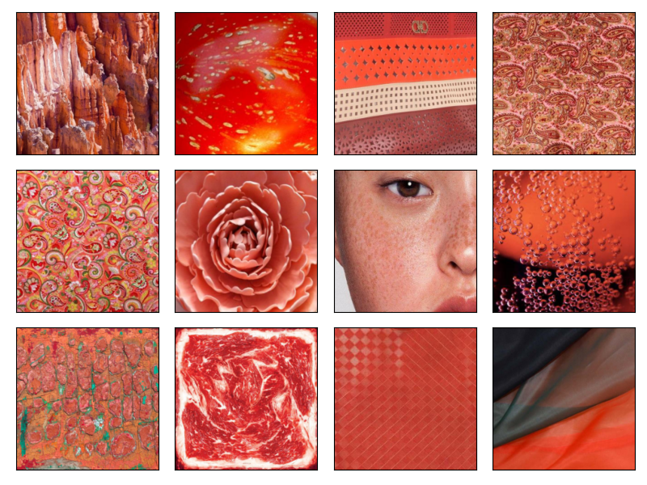
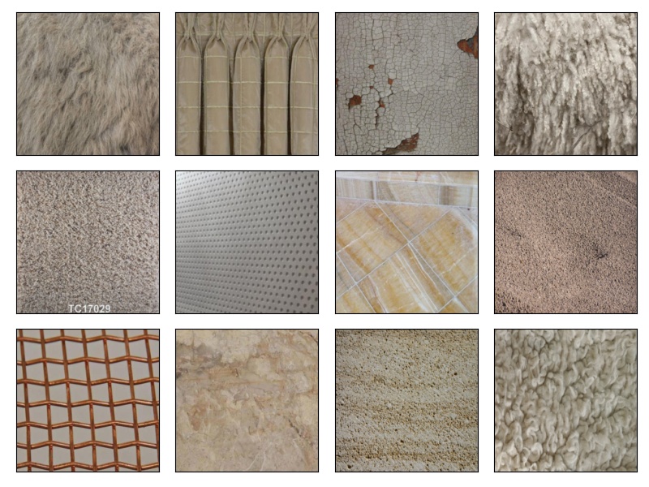
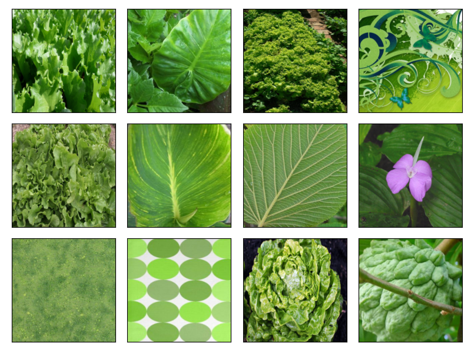
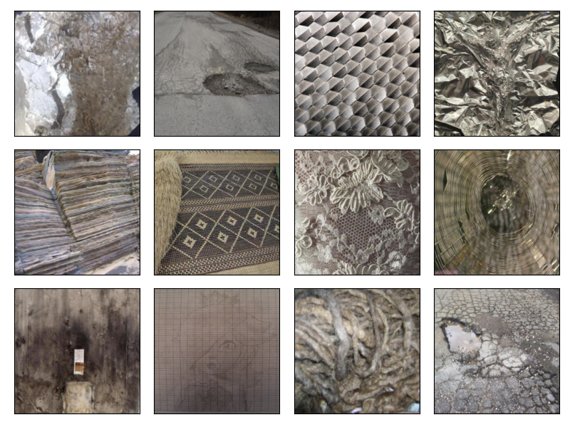
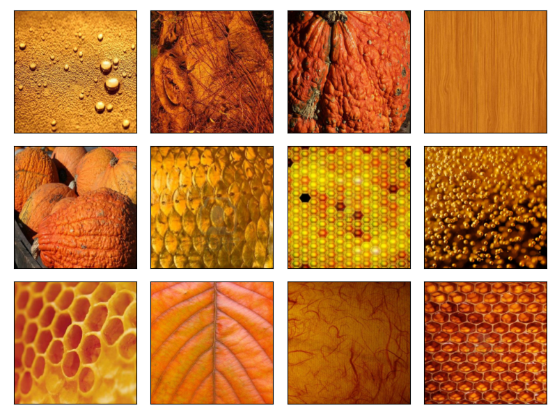

# Image Clustering

Please refer to this [jupyter notebook](image_clustering.ipynb) example.

```python
image_cluster = ImageClustering(num_clusters=64, batch_size=100, num_bins=[12,4,4], color_space="hsv", random_state=0, num_workers=32)
```

You can change color space and num_bins for each color.
Currently, it supports following color spaces.
```
rgb
hsv
lab
ycrcb
luv
yuv
```
Please contact me at hongshuo@usc.edu if you have any questions.









